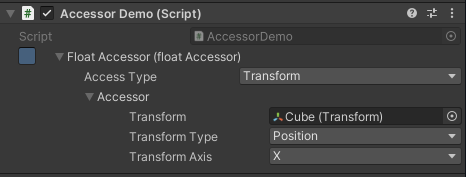

# Unity Value Accessors
A serializable object that allows scripts to dynamically access the fields of other objects in the scene.

## What is an Accessor?
In the same way that creating a public `float` field in a script adds a corresponding input box on the component where users can type in a `float` value, creating a public `FloatOrConstantAccessor` field creates an input area where users can create a reference that links to another `float` value in the scene. This is what an accessor looks like in the Unity editor:



``` c#
public class AccessorDemo : MonoBehaviour
{
    public FloatOrConstantAccessor floatAccessor;

}
```
This accessor is linking to the x position of `Cube`, which means that the logic that executes in the `Accessor Demo` script can read and modify the x position of `Cube`. A user can change this accessor at any time to point at a different value without needing to edit the underlying script.

Accessors are useful in situations where you find yourself writing the same script over and over again, but for modifying different values. For example, if you have one script that changes the color of an image over time and another script that changes the color of text over time, Accessors allow you to combine those two scripts into one script that just changes any color over time. The Accessor handles sending that color to the appropriate object.

For an example of a use case for Accessors, check out my [Unity Animation Modifiers](https://github.com/ollyisonit/UnityAnimationModifiers) package. It uses accessors to allow users to apply procedural animations to objects' attributes without needing write any additional scripts.

## Features

 - Accessors for commonly used int, bool, float, string, Color, Vector2, and Vector3 values in Unity, such as Image.Color and Transform.position
 - The ability to access int, bool, float, string, Color, Vector2, and Vector3 values from any object by name
 - The ability to access random int, float, Vector2, and Vector3 values with custom bias
 - The ability to convert between supported types
 - The ability to toggle between accessed values and constant values in-editor
 - Full support for implementing your own custom Accessors

## Usage
An Accessor stores a reference to a value on an object. It has two methods: GetValue(), which returns the value that is being referenced, and SetValue(), which sets the value being referenced. For example, you could make an Accessor that stores a reference to the x position of a Transform; the GetValue() method would return the Transform's x position and the SetValue() would set the Transform's x position.
Accessors also contain a Reset() method that can be used to reset the Accessor back to a sensible default state. All Accessors in this library will default to referencing components on the same GameObject that they are attached to.
Finally, Accessors have a Value property that can be get and set as shorthand for calling the GetValue() and SetValue() methods.

### The AnyOrConstant Accessor
The AnyOrConstant Accessor is the most versatile type of Accessor in this library, and it's the only type of Accessor you should ever need to use. It allows the user to toggle between using a constant value and using any Accessor in the library. Seven AnyOrConstant accessors are included in this library, one for each supported data type:
 - FloatOrConstantAccessor
 - IntOrConstantAccessor
 - BoolOrConstantAccessor
 - StringOrConstantAccessor
 - ColorOrConstantAccessor
 - Vector2OrConstantAccessor
 - Vector3OrConstantAccessor
 
When you add one of these objects to your script as a public variable, it will show up in the editor with a small button next to its name. Clicking that button will toggle the Accessor between constant mode, where you can type in the value you want the Accessor to reference, and referenced mode, where you will be presented with a dropdown menu containing all of the different ways you can access a value of that type. Depending on the data type that you are trying to access, different options will become available in the dropdown. For example, the FloatOrConstantAccessor allows you to pick from a variety of sources to take values from, including Transforms, Lights, and AudioSources. However, the dropdown will always contain at least these three options:
 - Constant: Gets a constant value that you type into the inspector
 - Custom: Gets a value from a CustomValueAccessor that you've implemented yourself
 - Reflected: Allows you to get a value from any field or property of any object in the Unity editor by name
 
 If you don't want to give the option to choose between a constant and accessed value, use the type's corresponding AnyAccessor (AnyFloatAccessor for FloatOrConstantAccessor, AnyStringAccessor for StringOrConstantAccessor, etc).

### Custom Accessors
If you want to make your own accessor that is compatible with the AnyAccessors and the AnyOrConstantAccessors, you can do so by extending the appropriate CustomAccessor class. For example, if you want to make a custom Accessor for float values, you would extend CustomFloatAccessor. Next, you would need to attach that script to a GameObject, and reference that script from an AnyAccessor or AnyOrConstantAccessor that has been set to 'Custom'.

If you want to make an accessor for a type that isn't supported by the library, you either can extend the Accessor<T\> class for Accessors that will appear as menus in-editor, or the CustomAccessor<T\> class for Accessors that will appear as MonoBehaviours that you can attach to objects and reference. If you're extending Accessor<T\>, make sure to mark your class with the [Serializable] attribute or it won't show up in the editor. If you're extending the CustomAccessor<T\> class, you first need to extend it into an empty abstract class that uses T as the type you are trying to access and then use that abstract class for creating your Accessors. The reason you have to do this is that Unity cannot display generic classes in-editor.

### The ResetAccessors Method
If you have a lot of Accessors in a script, it can be annoying to need to call each of their Reset() methods individually. The ResetAccessors.Reset method will automatically find and reset all Accessor fields on the object you give it. If any of those fields are null, new Accessors of the appropriate type will be automatically created and reset to fill them.

## Installation
[Download](https://github.com/ollyisonit/UnityAnimationModifiers/releases/latest) or clone this repository and drop it into your Unity project's Assets folder.

### Dependencies
This library requires that you have the [UnityEditorAttributes](https://github.com/ollyisonit/UnityEditorAttributes) library in your Unity project.

